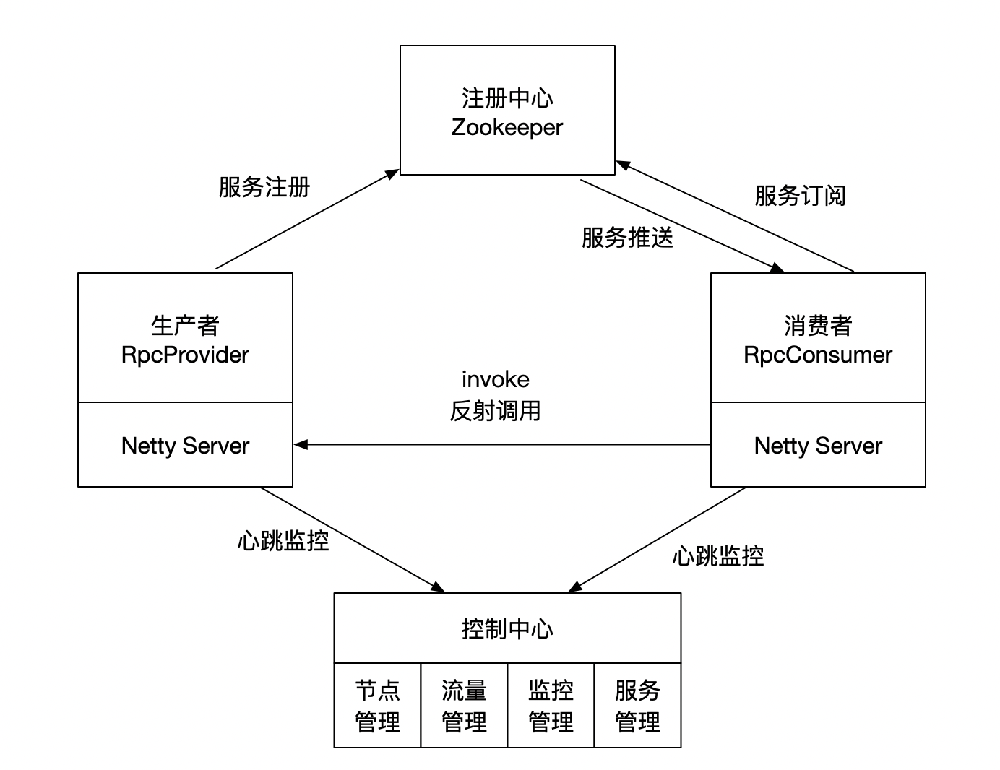

## 自定义实现RPC

### 自定义实现RPC框架

通过注解实现以下服务注册和调用:

服务注册：
```java
@MyProvider(serviceInterface = HelloService.class, version = "0.0.1")
public class HelloServiceImpl implements HelloService {
    @Override
    public String hello(String param) {
        System.out.println("hello");
        return "hello, " + param;
    }
}
```


服务调用：
```java
@MyConsumer(serviceVersion = "0.0.1")
private MyService myService;
```


### RPC主要框架

要实现一个完整的RPC框架，需要实现以下几个核心模块：


#### 注册中心

这里注册中心采用Zookeeper实现，可以实现服务注册，服务发现等功能，除了zk以外还可以使用eureka/etcd等

#### 网络连接

直接使用Netty实现，异步通信、高性能网络框架， 关于Netty使用的教程见[Netty](https://github.com/guangxush/wheel/tree/master/Netty)

#### 序列化协议

使用Hession协议，实现消息传输的序列化和反序列化，对消息进行了压缩处理，性能高

#### 动态代理CGLib

使用FastClass库，高性能的动态代理库

备注： 之前实现过简单的RPC框架，但是没有注册中心，直接进行调用，[RPC Demo](https://github.com/guangxush/wheel/tree/master/RPC)

#### 代码框架

整体代码结构如下

```text
.
├── annotation  自定义注解
├── commons   公共模块
├── constants  常量属性值
├── consumer  消费者
├── management  控制中心
├── provider  生产者
├── ptotocol 序列化协议
└── register 注册中心
```

### Zookeeper实现注册中心

注册中心主要完成服务注册，服务发现，能够监听服务数据并对请求进行负载均衡。

注册中心框架：

```java
public interface ServiceRegistry {

    /**
     * 服务注册
     * @param serviceModel
     * @throws Exception
     */
    void register(ServiceModel serviceModel) throws Exception;

    /**
     * 服务注销
     * @param serviceModel
     * @throws Exception
     */
    void unRegister(ServiceModel serviceModel) throws Exception;

    /**
     * 服务发现
     * @param serviceName
     * @return
     * @throws Exception
     */
    ServiceModel discovery(String serviceName) throws Exception;

    /**
     * 服务关闭
     * @throws Exception
     */
    void close() throws Exception;
}
```
不同的注册中心都可以实现上述接口，支持多种注册模式。

这里使用Curator完成服务注册，服务注销，服务发现。Curator是Netflix公司开源的一套zookeeper客户端框架，解决了很多Zookeeper客户端非常底层的细节开发工作，包括连接重连、反复注册Watcher和NodeExistsException异常等等。
“Guava is to Java that Curator to Zookeeper”

使用的依赖是
```xml
        <!-- 对zookeeper的底层api的一些封装 -->
        <dependency>
            <groupId>org.apache.curator</groupId>
            <artifactId>curator-framework</artifactId>
            <version>2.12.0</version>
            <exclusions>
                <exclusion>
                    <groupId>log4j</groupId>
                    <artifactId>log4j</artifactId>
                </exclusion>
            </exclusions>
        </dependency>
        <!-- 封装了一些高级特性，如：Cache事件监听、选举、分布式锁、分布式Barrier -->
        <dependency>
            <groupId>org.apache.curator</groupId>
            <artifactId>curator-recipes</artifactId>
            <version>2.12.0</version>
        </dependency>
        <dependency>
            <groupId>org.apache.curator</groupId>
            <artifactId>curator-x-discovery</artifactId>
            <version>2.12.0</version>
        </dependency>
```

直接调包，[参考链接](https://www.jianshu.com/p/db65b64f38aa)，具体实现方式如下：

```Java
public class ZookeeperServiceRegistry implements ServiceRegistry {
    private final CuratorFramework curatorFramework;
    private final Object lock = new Object();
    private ServiceDiscovery<ServiceModel> serviceDiscovery;

    /**
     * 提供本地缓存服务，避免过多创建请求
     */
    private Map<String, ServiceProvider<ServiceModel>> serviceProviderCache;
    private List<Closeable> closeableProvider = Lists.newArrayList();

    public ZookeeperServiceRegistry(String address) throws Exception {
        serviceProviderCache = new ConcurrentHashMap<>(256);
        this.curatorFramework = CuratorFrameworkFactory.newClient(address, new ExponentialBackoffRetry(1000, 3));
        this.curatorFramework.start();
        JsonInstanceSerializer<ServiceModel> serializer = new JsonInstanceSerializer<>(ServiceModel.class);
        serviceDiscovery = ServiceDiscoveryBuilder.
                builder(ServiceModel.class)
                .client(this.curatorFramework)
                .serializer(serializer)
                .basePath(BASE_URL)
                .build();
        serviceDiscovery.start();
    }

    @Override
    public void register(ServiceModel serviceModel) throws Exception {
        ServiceInstance<ServiceModel> serviceInstance = ServiceInstance
                .<ServiceModel>builder()
                //使用{服务名}:{服务版本}来唯一标识一个服务
                .name(ProviderUtils.generateKey(serviceModel.getServiceName(), serviceModel.getServiceVersion()))
                .address(serviceModel.getAddress())
                .port(serviceModel.getPort())
                .payload(serviceModel)
                .uriSpec(new UriSpec("{scheme}://{address}:{port}"))
                .build();
        serviceDiscovery.registerService(serviceInstance);
    }

    @Override
    public void unRegister(ServiceModel serviceModel) throws Exception {
        ServiceInstance<ServiceModel> serviceInstance =
                ServiceInstance.<ServiceModel>builder()
                .name(ProviderUtils.generateKey(serviceModel.getServiceName(), serviceModel.getServiceVersion()))
                .address(serviceModel.getAddress())
                .port(serviceModel.getPort())
                .payload(serviceModel)
                .uriSpec(new UriSpec("{scheme}://{address}:{port}"))
                .build();
        serviceDiscovery.unregisterService(serviceInstance);
    }

    @Override
    public ServiceModel discovery(String serviceName) throws Exception{
        // 读取缓存
        ServiceProvider<ServiceModel> serviceProvider = serviceProviderCache.get(serviceName);
        if (null == serviceProvider) {
            synchronized (lock) {
                serviceProvider = serviceDiscovery
                        .serviceProviderBuilder()
                        .serviceName(serviceName)
                        //设置负载均衡策略，这里使用轮询
                        .providerStrategy(new RoundRobinStrategy<>())
                        .build();
                serviceProvider.start();
                closeableProvider.add(serviceProvider);
                serviceProviderCache.put(serviceName, serviceProvider);
            }
        }
        ServiceInstance<ServiceModel> serviceInstance = serviceProvider.getInstance();
        return null != serviceInstance ? serviceInstance.getPayload() : null;
    }

    @Override
    public void close() throws Exception{
        for(Closeable closeable: closeableProvider) {
            CloseableUtils.closeQuietly(closeable);
        }
        serviceDiscovery.close();
    }
}
```

CAP理论分析zk具有CP特性，保障强一致性，不适合做注册中心，使用Eureka更适合注册中心一些，具有AP特性，可用性高。

### 生产者Provider

主要实现以下步骤：
```text
1. Sping容器扫描MyProvider注解注册的Bean；
2. 将所有添加生产者按照{服务名：版本号}的形式注册到注册中心，并添加到本地缓存
3. 启动Netty监听消费请求
4. 对消费请求进行解析，获取本地缓存的bean，使用动态代理完成请求调用
5. 对处理结果进行序列化封装，返回给消费者
```
#### 注解实现方式

```Java
@Retention(RetentionPolicy.RUNTIME) //运行时解析
@Target({ElementType.TYPE}) //class注解，只能标记在类上面
@Component //被Spring加载
public @interface MyProvider {
    Class<?> serviceInterface() default Object.class; // 接口

    String serviceVersion() default "0.0.1"; // 版本号
}
```

#### 1. 使用Spring扫描@MyProvider注解下的bean，并将相关的bean到注册中心

需要实现BeanPostProcessor接口，即可通过ApplicationContext获取到Spring容器加载的bean，每个bean会被调用一次，然后根据注解
@MyProvider 扫描相关的bean。

关键代码如下：

```Java
    @Override
    public Object postProcessBeforeInitialization(Object bean, String beanName) throws BeansException {
        return bean;
    }

    // 被Spring容器加载之后的bean，执行以下逻辑
    @Override
    public Object postProcessAfterInitialization(Object bean, String beanName) throws BeansException {
        // 获取MyProvider修饰的bean
        MyProvider myProvider = bean.getClass().getAnnotation(MyProvider.class);
        // 如果没有被修饰直接返回bean
        if(myProvider == null){
            return bean;
        }
        // 获取注解后的服务名，版本号
        String serviceName = myProvider.serviceInterface().getName();
        String version = myProvider.serviceVersion();
        String providerKey = ProviderUtils.generateKey(serviceName, version);
        // 缓存provider bean到本地缓存中
        handlerMap.put(providerKey, bean);

        // 服务注册到注册中心
        String[] address = serverAddress.split(":");
        String host = address[0];
        int port = Integer.parseInt(address[1]);
        // 创建服务元数据
        ServiceModel serviceModel = ServiceModel.builder()
                .address(host)
                .serviceName(serviceName)
                .servicePort(port)
                .serviceVersion(version);
        try {
            // 尝试注册服务到注册中心
            serviceRegistry.register(serviceModel);
            log.debug("register service... {}", serviceModel.toString());
        } catch (Exception e) {
            log.error("register fail {}", serviceModel.toString(), e);
        }
        // 返回bean
        return bean;
    }
```

#### 2. 使用Netty实现消息处理

实现一个Netty Server，端口号根据application.properties中的参数进行配置。

[参考链接](https://www.cnblogs.com/daijiting/p/11975579.html)

```Java
    /**
     * netty监听服务, 进行服务注册
     * @throws InterruptedException
     */
    public void start() throws InterruptedException {
        if (bossGroup == null || workerGroup == null) {
            // bossGroup线程的机制是多路复用, 都是NioEventLoopGroup，一个线程但是可以监听多个新连接
            // bossGroup用来处理nio的Accept，worker处理nio的Read和Write事件
            bossGroup = new NioEventLoopGroup();
            workerGroup = new NioEventLoopGroup();
            // ServerBootstrap是一个用来创建服务端Channel的工具类，创建出来的Channel用来接收进来的请求；只用来做面向连接的传输，像TCP/IP。
            ServerBootstrap bootstrap = new ServerBootstrap();
            //通用平台使用NioServerSocketChannel，Linux使用EpollServerSocketChannel
            bootstrap.group(bossGroup, workerGroup).channel(NioServerSocketChannel.class).childHandler(new ChannelInitializer<SocketChannel>() {
                @Override
                protected void initChannel(SocketChannel socketChannel) throws Exception {
                    socketChannel.pipeline()
                            .addLast(new LengthFieldBasedFrameDecoder(65536, 0, 4, 0, 0))
                            .addLast(new RpcDecoder())
                            .addLast(new RpcEncoder())
                            .addLast(new ProviderHandler(handlerMap));
                }
            }).option(ChannelOption.SO_BACKLOG, 128)
              .childOption(ChannelOption.SO_KEEPALIVE, true);
            String[] address = serverAddress.split(":");
            String host = address[0];
            int port = Integer.parseInt(address[1]);
            // 绑定端口，开启服务监听请求
            ChannelFuture future = bootstrap.bind(host, port).sync();
            log.info("Server started on port {}", port);
            // 同步等待，需要单独开启线程调用start方法
            future.channel().closeFuture().sync();
        }
    }

    /**
     * 后置处理，用于开启监听服务
     * @throws Exception
     */
    @Override
    public void afterPropertiesSet() throws Exception {
        new Thread(() -> {
            try {
                start();
            } catch (InterruptedException e) {
                e.printStackTrace();
            }
        }
        ).start();
    }
```

消息处理器实现：

使用的SimpleChannelInboundHandler来作为处理器的，实现其中的channelRead0方法，完成对消息的处理。SimpleChannelInboundHandler的channelRead0有个好处就是你不用关心释放资源，因为源码中已经帮你释放了。

```Java
    /**
     * rpc请求处理器
     * @param channelHandlerContext
     * @param rpcRequest
     * @throws Exception
     */
    @Override
    protected void channelRead0(ChannelHandlerContext channelHandlerContext, RpcRequest rpcRequest) throws Exception {
        RpcProvider.submit(() -> {
            log.debug("Receive request {}", rpcRequest.getRequestId());
            RpcResponse rpcResponse = new RpcResponse();
            rpcResponse.setRequestId(rpcRequest.getRequestId());
            try {
                // 调用消息处理方法
                Object result = handle(rpcRequest);
                rpcResponse.setResult(result);
            } catch (Throwable throwable) {
                rpcResponse.setException(throwable.toString());
                log.error("Rpc server handle request error", throwable);
            }
            channelHandlerContext.writeAndFlush(rpcResponse)
                    .addListener((ChannelFutureListener) channelFuture -> log.debug("send response for request:" + rpcRequest.getRequestId()));
        });
    }

    /**
     * 消息处理器核心实现
     * @param rpcRequest
     * @return
     * @throws Throwable
     */
    private Object handle(RpcRequest rpcRequest) throws Throwable {
        // 生成服务注册key
        String providerKey = ProviderUtils.generateKey(rpcRequest.getClassName(), rpcRequest.getServiceVersion());
        // 从缓存中获取相关的bean，缓存map的注册在RpcProvider中实现
        Object providerBean = handlerMap.get(providerKey);
        if (null == providerBean) {
            // 没有获取到当前bean服务
            throw new RuntimeException(String.format("Provider not exist: %s:%s", rpcRequest.getClassName(), rpcRequest.getMethodName()));
        }

        // 使用反射完成消息处理
        Class<?> providerClass = providerBean.getClass();
        String methodName = rpcRequest.getMethodName();
        Class<?>[] parameterTypes = rpcRequest.getParameterTypes();
        Object[] parameters = rpcRequest.getParameters();
        // 打印类名
        log.debug(providerClass.getName());
        // 打印方法名
        log.debug(methodName);
        // 打印参数类型
        for (Class<?> parameterType : parameterTypes) {
            log.debug(parameterType.getName());
        }
        // 打印参数
        for (Object parameter : parameters) {
            log.debug(parameter.toString());
        }
        // 使用Cglib创建服务生产者的代理对象，调用指定的方法
        FastClass providerFastClass = FastClass.create(providerClass);
        int methodIndex = providerFastClass.getIndex(methodName, parameterTypes);
        return providerFastClass.invoke(methodIndex, providerBean, parameters);
    }
```

#### 3. 实现对provider的封装

这里使用SpringBoot的start模式，创建一个自定义的SpringBoot Start

[参考文档](https://www.nosuchfield.com/2017/10/15/Spring-Boot-Starters/)

1. 创建ConfigurationProperties保存配置信息
2. 创建一个AutoConfiguration，引用定义好的配置信息，需要在AutoConfiguration中实现starter完成的所有操作
，并把这个类加入到spring.factories配置文件中进行声明
3. 打包项目，之后在其他SpringBoot项目中即可引入该项目的依赖了，然后可以调用该starter

注意pom.xml配置
```xml
    <!-- 自定义starter都要继承这个依赖 -->
    <parent>
        <groupId>org.springframework.boot</groupId>
        <artifactId>spring-boot-starters</artifactId>
        <version>1.5.2.RELEASE</version>
    </parent>
    <dependencies>
       <!-- 自定义starter依赖这个jar包，或者web starter -->
        <dependency>
            <groupId>org.springframework.boot</groupId>
            <artifactId>spring-boot-starter</artifactId>
        </dependency>
    <dependencies>
```

创建配置类保存配置信息：

```Java
@Data
@ConfigurationProperties(prefix = "rpc")
public class RpcProperties {
    // 从配置文件中获取该属性  application.properties
    private String serviceAddress; //对应的配置key为rpc.service-address
    private String serviceRegistryAddress;
    private String serviceRegistryType;
}
```

创建AutoConfiguration, 在Spring上下文中创建一个对象：

```Java
@Configuration
@EnableConfigurationProperties(RpcProperties.class)
public class ProviderAutoConfiguration {

    @Resource
    private RpcProperties properties;

    // 这个地方还可以添加其他的注解，用于作为判断条件，判断是否执行该方法，比如@ConditionalOnMissingBean等
    @Bean
    public RpcProvider init() throws Exception {
        // 根据配置选择注册中心
        ServiceRegistryType type = ServiceRegistryType.valueOf(properties.getServiceRegistryType());
        // 单例模式
        ServiceRegistry serviceRegistry = ServiceRegistryFactory.getInstance(type, properties.getServiceRegistryAddress());
        return new RpcProvider(properties.getServiceAddress(), serviceRegistry);
    }
}
```

最后，需要在recourse目录下创建META-INF文件夹，然后新建spring.factories文件，配置AutoConfiguration:

```Java
org.springframework.boot.autoconfigure.EnableAutoConfiguration=\
com.shgx.rpc.provider.ProviderAutoConfiguration
```

在另一个SpringBoot项目中，引入当前jar包，即可使用当前的starter。


### 消费者Consumer实现

消费者的使用方式如下，非常简洁，根平时用的Dubbo消费者注解类似，根据服务名+注解中的版本号，即可从注册中心找到一个服务生产者的地址，然后通过反射构造一个代理对象，消费者调用
远程服务时，生产者获取网络请求，通过上述handler实现结果并返回给消费者。

```Java
@MyConsumer(version = "0.0.1")
private HelloService helloService;
```

消费者的实现思路如下：

```text
1. 扫描MyConsumer下的变量
2. 使用代理类实例化消费者bean
3. 代理类调用通过注册中心，获取IP+端口号，发起Netty远程调用
4. 将生产者的处理结果返回
```

#### 1. MyConsumer注解定义

当前注解类似于@Autowired, 从Spring容器中获取bean实例

```Java
@Retention(RetentionPolicy.RUNTIME) //运行时解析
@Target({ElementType.FIELD}) //注解目标为属性
@Autowired //被Spring加载
public @interface MyConsumer {
    /**
     * com.shgx.rpc.consumer.ConsumerBean#setVersion(java.lang.String)
     * @return
     */
    String serviceVersion() default "0.0.1";

    /**
     * com.shgx.rpc.consumer.ConsumerBean#setRegistryAddress(java.lang.String)
     * @return
     */
    String registryAddress() default "127.0.0.1:2181";

    /**
     * com.shgx.rpc.consumer.ConsumerBean#setRegistryType(java.lang.String)
     * @return
     */
    String registryType() default "zookeeper";
}
```

#### 2. 实现bean注入

通过实现BeanFactoryPostProcessor接口，可以把接口变成一个Bean实例，注入到Spring容器，在Spring Boot启动方法里面
，会先加载所有的BeanFactoryPostProcessors，然后再加载BeanPostProcessors。

Springboot在启动的时候，会调用run方法，创建环境设置spring容器，其中包含refresh方法，完成配置类解析，各种beanFactoryPostProcess和beanPostProcessor注册，web内置容器构造，国际化配置初始化等,refresh调用了父类AbstractApplicationContext的refresh方法如下。
[参考链接](https://www.jianshu.com/p/577906fa2cc2)

```Java
@Override
public void refresh() throws BeansException, IllegalStateException {
    synchronized (this.startupShutdownMonitor) {
    // 准备，记录容器的启动时间startupDate, 标记容器为激活，初始化上下文环境如文件路径信息，验证必填属性是否填写
    prepareRefresh();

    // 这步比较重要(解析)，告诉子类去刷新bean工厂，这步完成后配置文件就解析成一个个bean定义，注册到BeanFactory（但是未被初始化，仅将信息写到了beanDefination的map中）
    ConfigurableListableBeanFactory beanFactory = obtainFreshBeanFactory();

    // 设置beanFactory类加载器，添加多个beanPostProcesser
    prepareBeanFactory(beanFactory);

    try {
        // 允许子类上下文中对beanFactory做后期处理
        postProcessBeanFactory(beanFactory);

        // 调用BeanFactoryPostProcessor各个实现类的方法
        invokeBeanFactoryPostProcessors(beanFactory);

        // 注册 BeanPostProcessor 的实现类，注意看和 BeanFactoryPostProcessor 的区别
        // 此接口两个方法: postProcessBeforeInitialization 和 postProcessAfterInitialization
        // 两个方法分别在 Bean 初始化之前和初始化之后得到执行。注意，到这里 Bean 还没初始化
        registerBeanPostProcessors(beanFactory);

        //初始化ApplicationContext的MessageSource
        initMessageSource();

        //初始化ApplicationContext事件广播器
        initApplicationEventMulticaster();

        // 初始化子类特殊bean（钩子方法）
        onRefresh();

        // 注册事件监听器
        registerListeners();

        // 初始化所有singleton bean  重点！！重点！！
        finishBeanFactoryInitialization(beanFactory);

        // 广播事件，ApplicationContext初始化完成
        finishRefresh();
} catch (BeansException ex) {
 // 省略
}
```

所以可以先通过postProcessBeanFactory找到所有被MyConsumer修饰的属性，即Field

```Java
@MyConsumer(version = "0.0.1")
private HelloService helloService;
```

拿到MyConsumer这个属性后，再把这个属性的接口替换为代理Bean，并重新注册到Spring的beanDefinitionMap中，即可实现bean的hack

核心代码如下：

```Java
    @Override
    public void postProcessBeanFactory(ConfigurableListableBeanFactory beanFactory) throws BeansException {
        this.beanFactory = beanFactory;
        //遍历容器里的所有bean
        for (String beanName : beanFactory.getBeanDefinitionNames()) {
            BeanDefinition definition = beanFactory.getBeanDefinition(beanName);
            String beanClassName = definition.getBeanClassName();
            // 当用 @Bean 返回的类型是Object时，beanClassName是 null
            if(beanClassName != null) {
                //使用反射获取bean的class对象，注意classloader是容器加载bean的classloader
                Class<?> clazz = ClassUtils.resolveClassName(definition.getBeanClassName(), this.classLoader);
                ReflectionUtils.doWithFields(clazz, this::parseElement);
            }
        }

        //重新注入到容器中
        BeanDefinitionRegistry registry = (BeanDefinitionRegistry)beanFactory;
        this.beanDefinitionMap.forEach((beanName, beanDefinition) -> {
            if (context.containsBean(beanName)) {
                throw new IllegalArgumentException("[RPC Starter] Spring context already has a bean named " + beanName
                        + ", please change @MyConsumer field name.");
            }
            registry.registerBeanDefinition(beanName, beanDefinitionMap.get(beanName));
            log.info("registered ConsumerBean {} in spring context.", beanName);
        });
    }

    /**
     * 动态修改被MyConsumer注解的bean，改为代理类
     * @param field
     */
    private void parseElement(Field field) {
        MyConsumer annotation = AnnotationUtils.getAnnotation(field, MyConsumer.class);
        if (annotation == null) {
            return;
        }
        //构造工厂bean的参数
        BeanDefinitionBuilder builder = BeanDefinitionBuilder.genericBeanDefinition(ConsumerBean.class);
        builder.setInitMethodName(Constants.INIT_METHOD);
        builder.addPropertyValue("serviceVersion", annotation.serviceVersion());
        builder.addPropertyValue("interfaceClass", field.getType());
        builder.addPropertyValue("registryType", annotation.registryType());
        builder.addPropertyValue("registryAddress", annotation.registryAddress());

        BeanDefinition beanDefinition = builder.getBeanDefinition();
        beanDefinitionMap.put(field.getName(), beanDefinition);
    }

```
ConsumerBean是自定义的代理消费者bean，实现了FactoryBean接口。
这样SpingBoot启动的时候，会把RpcConsumer修饰的bean替换为自定义的ConsumerBean

```Java
@Slf4j
public class ConsumerBean implements FactoryBean {

    private Class<?> interfaceClass;
    private String serviceVersion;
    private String registryType;
    private String registryAddress;
    private Object object;

    @Override
    public Object getObject() throws Exception {
        return this.object;
    }

    @Override
    public Class<?> getObjectType() {
        return interfaceClass;
    }

    @Override
    public boolean isSingleton() {
        return true;
    }

    public void setInterfaceClass(Class<?> interfaceClass) {
        this.interfaceClass = interfaceClass;
    }

    public void setServiceVersion(String serviceVersion) {
        this.serviceVersion = serviceVersion;
    }

    public void setRegistryType(String registryType) {
        this.registryType = registryType;
    }

    public void setRegistryAddress(String registryAddress) {
        this.registryAddress = registryAddress;
    }

    public void init() throws Exception {
        this.object = RpcConsumer.create(interfaceClass, serviceVersion, ServiceRegistryFactory.getInstance(
                ServiceRegistryType.valueOf(registryType), registryAddress
        ));
        log.info("ConsumerBean {} init ...", interfaceClass.getName());
    }

}
```

#### 3. 实现动态代理

使用Proxy.newProxyInstance实现动态代理
```Java
    public static <T> T create(Class<T> interfaceClass, String serviceVersion, ServiceRegistry serviceRegistry) {
        return (T) Proxy.newProxyInstance(
                interfaceClass.getClassLoader(),
                new Class<?>[]{interfaceClass},
                new RpcInvokeHandler<>(serviceVersion, serviceRegistry));
    }
```
动态代理实现RpcInvokeHandler

```Java
@Slf4j
public class RpcInvokeHandler<T> implements InvocationHandler {

    private static final String EQUALS = "equals";
    private static final String HASH_CODE = "hashCode";
    private static final String TO_STRING = "toString";

    private String serviceVersion;
    private ServiceRegistry serviceRegistry;

    public RpcInvokeHandler() {
    }

    public RpcInvokeHandler(String serviceVersion, ServiceRegistry serviceRegistry) {
        this.serviceVersion = serviceVersion;
        this.serviceRegistry = serviceRegistry;
    }

    @Override
    public Object invoke(Object proxy, Method method, Object[] args) throws Throwable {
        if (Object.class == method.getDeclaringClass()) {
            String name = method.getName();
            switch (name) {
                case EQUALS:
                    return proxy == args[0];
                case HASH_CODE:
                    System.identityHashCode(proxy);
                    break;
                case TO_STRING:
                    return proxy.getClass().getName() + "@" + Integer.toHexString(System.identityHashCode(proxy)) + ", with InvocationHandler" + this;
                default:
                    throw new IllegalStateException(String.valueOf(method));
            }
        }
        RpcRequest rpcRequest = new RpcRequest();
        rpcRequest.setRequestId(UUID.randomUUID().toString());
        rpcRequest.setClassName(method.getDeclaringClass().getName());
        rpcRequest.setServiceVersion(this.serviceVersion);
        rpcRequest.setMethodName(method.getName());
        rpcRequest.setParameterTypes(method.getParameterTypes());
        rpcRequest.setParameters(args);

        log.debug(method.getDeclaringClass().getName());
        log.debug(method.getName());
        for(int i=0;i<method.getParameterTypes().length;i++){
            log.debug(method.getParameterTypes()[i].getName());
        }
        for (Object arg : args) {
            log.debug(arg.toString());
        }

        RpcConsumer rpcConsumer = new RpcConsumer(this.serviceRegistry);
        RpcResponse rpcResponse = rpcConsumer.sendRequest(rpcRequest);
        if(null != rpcResponse){
            log.debug("consumer receive provider rpc response:" + rpcResponse.toString());
            return rpcResponse.getResult();
        }else{
            throw new RuntimeException("consumer rpc fail, response is null!");
        }
    }
}
```

#### 4. 采用同样的方式封装Start

```Java
@Configuration
@EnableConfigurationProperties(RpcProperties.class)
public class RpcConsumerAutoConfiguration {
    @Bean
    public static BeanFactoryPostProcessor rpcConsumerPostProcess() {
        return new RpcConsumerPostProcessor();
    }
}
```
同样方式注入到spring.factories文件：

```Java
org.springframework.boot.autoconfigure.EnableAutoConfiguration=\
com.shgx.rpc.provider.ProviderAutoConfiguration,\
com.shgx.rpc.consumer.ConsumerAutoConfiguration
```

### 控制中心

控制中心相对独立，可以对流量请求统一进行管控。

### MyRPC使用方式

0. 打开zookeeper
```text
zkServer start
```
1. 当前project打包```mvn clean install -Dmaven.test.skip=true```

2. 新建一个SpringBoot项目，具体可以参考[目录](./test-rpc/)其他项目里面引入jar包和Maven依赖，注意版本号

```text
<dependency>
    <groupId>com.shgx</groupId>
    <artifactId>rpc</artifactId>
    <version>0.0.3-SNAPSHOT</version>
</dependency>
```

这个版本号与原来项目中pom.xml中的配置有关
```xml
   <groupId>com.shgx</groupId>
   <artifactId>rpc</artifactId>
   <version>0.0.3-SNAPSHOT</version>
```

3. 设置配置文件：application.properties

2181是zookeeper默认服务端口
```text
# rpc
rpc.service-address=127.0.0.1:6689
rpc.service-registry-type=zookeeper
rpc.service-registry-address=127.0.0.1:2181
```

4. 服务发布

```java
@MyProvider(serviceInterface = HelloService.class, version = "0.0.1")
public class HelloServiceImpl implements HelloService {
    @Override
    public String hello(String param) {
        System.out.println("hello");
        return "hello, " + param;
    }
}
```

5. 服务调用

```java
@Controller
public class HelloController {

    @MyConsumer(version = "0.0.1")
    private HelloService helloService;

    @GetMapping("/hello")
    public String testHello(@RequestParam String param){
        return helloService.hello(param);
    }
}
```

6. 运行结果

关键日志打印结果
```
registered ConsumerBean helloService in spring context.
ConsumerBean com.shgx.test.service.HelloService init ...
Server started on port 6689
```

浏览器访问http://localhost:8081/hello?param=rpc
访问结果

```
hello, rpc
```

### 参考文档

[一个轻量级RPC框架](https://www.cnblogs.com/luxiaoxun/p/5272384.html)
